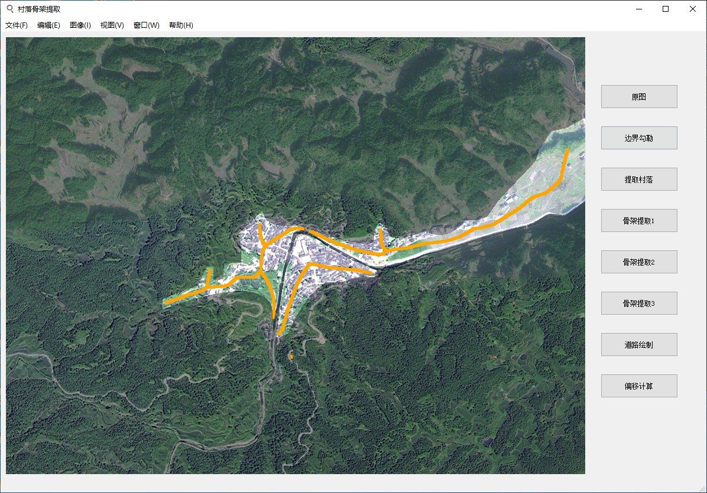

# 村落骨架提取
This is a python project that extract the village skeleton from remote sensing image.

村落选址与山水分析的python图像处理项目

<p align="center">
    
</p>

### 安装Pytorch和其它依赖：
```bash
# Python 3.8.5
pip install opencv-python pillow pyqt5 
```

# 使用

```bash
python main.py
```

# 操作流程
① 点击“文件”->"打开"加载遥感图像;  

② 如果选择自动添加轮廓线，点击“文件”->“添加轮廓线”选择对应的带有轮廓线的遥感图像;  

③ 如果选择手动勾勒轮廓线，忽略步骤②，点击“边界勾勒”，勾勒村落边界或山水轮廓线。勾勒
  时，点击右键可以新建一块新的区域，建议勾勒的轮廓线尽量闭合;  
  
④ 点击“提取村落”，可以看到村落区域被分割了出来;  

⑤ 点击“骨架提取1”， “骨架提取2”， “骨架提取3”可分别进行3种不同的骨架提取算法;  

⑥ 点击“道路绘制”可进行道路的绘制，标记方式同③相同;  

⑦ 最后利用绘制的道路进行偏移计算；

# 备注
在进行轮廓线的自动提取时，默认可识别的轮廓线颜色为红色，若想识别其他颜色的轮廓线，需  

点击“图像”->“取色” 选取对应颜色，颜色分类共有red、orange、yellow、green、cyan、blue  

purple、black、gray、white这十种。